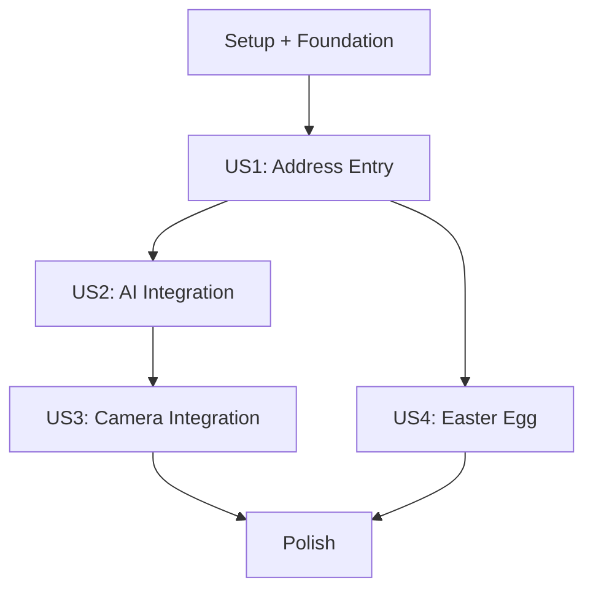

---

description: "Task list template for feature implementation"
---

# Tasks: Rescan - Recycling Scanner Web Application

**Input**: Design documents from `/specs/001-recycling-scanner-app/`
**Prerequisites**: plan.md (required), spec.md (required for user stories), research.md, data-model.md, contracts/

**Tests**: Manual testing scenarios defined per constitutional requirements (no unit tests needed for rapid prototype).

**Organization**: Tasks are grouped by user story to enable independent implementation and testing of each story.

## Format: `[ID] [P?] [Story] Description`

- **[P]**: Can run in parallel (different files, no dependencies)
- **[Story]**: Which user story this task belongs to (e.g., US1, US2, US3, US4)
- Include exact file paths in descriptions

## Path Conventions

**Web app structure**: `backend/src/`, `frontend/src/` based on plan.md educational architecture

---

## Phase 1: Setup & Educational Foundation

**Purpose**: Project initialization, basic structure, and educational scaffolding for STEM learning environment

- [X] T001 Create project directory structure per implementation plan (backend/, frontend/, docs/)
- [X] T002 Initialize Node.js project with package.json and educational dependencies
- [X] T003 [P] Configure ESLint and Prettier for code consistency and learning
- [X] T004 [P] Create .env.example with educational configuration comments  
- [X] T005 [P] Setup educational README.md with learning objectives and setup instructions
- [X] T006 [P] Create .gitignore for Node.js project with educational comments
- [X] T007 [P] Initialize SQLite database directory and configuration in backend/src/config/database.js

---

## Phase 2: Foundational (Blocking Prerequisites)

**Purpose**: Core infrastructure that MUST be complete before ANY user story can be implemented

**⚠️ CRITICAL**: No user story work can begin until this phase is complete

- [X] T008 Setup Express.js server with basic middleware in backend/src/api/server.js
- [X] T009 [P] Configure CORS, JSON parsing, and static file serving middleware  
- [X] T010 [P] Create database schema setup script for Address and ScanSession tables
- [X] T011 [P] Implement database connection management in backend/src/services/dbService.js
- [X] T012 [P] Setup error handling middleware with educational error messages
- [X] T013 [P] Create logging configuration for educational transparency
- [X] T014 [P] Implement health check endpoint `/api/health` in backend/src/api/routes/health.js
- [X] T015 Configure environment variable loading with validation
- [X] T016 [P] Create frontend base HTML template with responsive meta tags
- [X] T017 [P] Setup frontend CSS foundation in frontend/src/assets/css/styles.css
- [X] T018 [P] Implement frontend API service base in frontend/src/services/api.js

**Checkpoint**: Foundation ready - user story implementation can now begin in parallel

---

## Phase 3: User Story 1 - Basic Address Entry and Points Lookup (Priority: P1) 🎯 MVP

**Goal**: Enable users to enter street address and view recycling points total, establishing database foundation

**Independent Test**: User can navigate from home page → login page → enter address → see points total (0 for new, actual for existing)

### Implementation for User Story 1

- [X] T019 [P] [US1] Create Address model with validation in backend/src/models/address.js
- [X] T020 [P] [US1] Implement address lookup database operations in backend/src/services/dbService.js
- [X] T021 [US1] Create address lookup endpoint `/api/address/lookup` in backend/src/api/routes/address.js
- [X] T022 [US1] Add input validation and sanitization for street addresses
- [X] T023 [US1] Implement new address creation logic with initial points (0)
- [X] T024 [P] [US1] Create home page with tax reduction question in frontend/src/pages/home.html
- [X] T025 [P] [US1] Create login page with address entry form in frontend/src/pages/login.html
- [X] T026 [US1] Implement home page navigation logic in frontend/src/assets/js/app.js
- [X] T027 [US1] Implement address submission and points display logic
- [X] T028 [US1] Add "scan an item and earn points" navigation button
- [X] T029 [US1] Style responsive forms and feedback messages with educational clarity

**US1 Manual Testing Scenarios**:
- [X] T030 [US1] Test new address entry → verify "You have no points" message  
- [X] T031 [US1] Test existing address lookup → verify correct points display
- [ ] T032 [US1] Test address validation → verify helpful error messages
- [ ] T033 [US1] Test responsive design → verify mobile and desktop functionality

**Checkpoint**: At this point, User Story 1 should be fully functional - users can enter addresses and see points totals

---

## Phase 4: User Story 2 - Manual Image Upload and AI Recognition (Priority: P2) 

**Goal**: Enable image upload for AI analysis, material identification, and points awarding - core educational AI integration

**Independent Test**: User can upload recycling symbol image → receive material identification → earn appropriate points

### Implementation for User Story 2

- [X] T034 [P] [US2] Create ScanSession model with validation in backend/src/models/scanSession.js  
- [X] T035 [P] [US2] Configure multer middleware for image uploads in backend/src/api/routes/scan.js
- [X] T036 [P] [US2] Implement Azure OpenAI service integration in backend/src/services/aiService.js
- [X] T037 [US2] Create image upload endpoint `/api/scan/upload` with file validation
- [X] T038 [US2] Implement AI prompt engineering for RIC symbol identification
- [X] T039 [US2] Add image analysis response parsing and confidence scoring
- [X] T040 [US2] Implement points calculation logic (100 recyclable, 10 non-recyclable)
- [X] T041 [US2] Create database transaction for scan recording and points update
- [X] T042 [US2] Add educational error handling for AI service failures
- [X] T043 [P] [US2] Create scan page with upload interface in frontend/src/pages/scan.html
- [X] T044 [P] [US2] Implement file upload component in frontend/src/components/upload.js
- [X] T045 [US2] Add image preview and upload progress indicators
- [X] T046 [US2] Implement scan results display with educational feedback
- [X] T047 [US2] Style scan interface with drag-and-drop and progress animations
- [X] T048 [US2] Add navigation from address lookup to scan page

**US2 Manual Testing Scenarios**:
- [ ] T049 [US2] Test recyclable item upload → verify 100 points awarded and educational message
- [ ] T050 [US2] Test non-recyclable item upload → verify 10 points awarded and learning feedback  
- [ ] T051 [US2] Test invalid image format → verify helpful error with educational guidance
- [ ] T052 [US2] Test clear RIC symbol → verify accurate material type identification
- [ ] T053 [US2] Test unclear/no symbol → verify graceful error handling with learning tips

**Checkpoint**: At this point, User Story 2 should be fully functional - core AI education and recycling learning delivered

---

## Phase 5: User Story 3 - Camera Integration for Real-time Scanning (Priority: P3)

**Goal**: Enable real-time camera capture for enhanced user experience and device API learning

**Independent Test**: User can activate camera → capture image → receive same analysis as manual upload

### Implementation for User Story 3

- [ ] T054 [P] [US3] Create camera component with MediaDevices API in frontend/src/components/camera.js
- [ ] T055 [P] [US3] Implement camera permission handling and user feedback
- [ ] T056 [US3] Add camera preview with live video stream display
- [ ] T057 [US3] Implement photo capture with canvas processing
- [ ] T058 [US3] Add base64 image encoding for API transmission
- [ ] T059 [US3] Create camera scan endpoint `/api/scan/camera` in backend/src/api/routes/scan.js
- [ ] T060 [US3] Implement feature detection for camera capability
- [ ] T061 [US3] Add graceful fallback to file upload for unsupported devices
- [ ] T062 [US3] Enhance scan page with camera toggle option
- [ ] T063 [US3] Style camera interface with capture button and controls
- [ ] T064 [US3] Add camera status indicators and educational messaging

**US3 Manual Testing Scenarios**:
- [ ] T065 [US3] Test camera activation → verify live preview appears
- [ ] T066 [US3] Test photo capture → verify same AI analysis as upload
- [ ] T067 [US3] Test camera permission denial → verify fallback to upload
- [ ] T068 [US3] Test mobile camera → verify orientation and experience
- [ ] T069 [US3] Test desktop camera → verify consistent functionality

**Checkpoint**: At this point, User Story 3 should be fully functional - enhanced camera experience available

---

## Phase 6: User Story 4 - Fun Home Page Engagement (Priority: P4)

**Goal**: Add Easter egg engagement feature for user enjoyment

**Independent Test**: User clicks "No" on tax reduction question → YouTube video appears in iframe

### Implementation for User Story 4

- [ ] T070 [P] [US4] Add "No" button click handler to home page
- [ ] T071 [P] [US4] Create iframe YouTube video embed functionality  
- [ ] T072 [P] [US4] Style video overlay with responsive design
- [ ] T073 [P] [US4] Add video close button and return to main flow

**US4 Manual Testing Scenarios**:
- [ ] T074 [US4] Test "No" button click → verify video loads correctly
- [ ] T075 [US4] Test video close → verify return to normal flow

**Checkpoint**: At this point, User Story 4 should be functional - engagement feature complete

---

## Phase 7: Polish & Cross-Cutting Concerns

**Purpose**: Final enhancements, performance optimization, and educational documentation

- [ ] T076 [P] Optimize responsive design for all screen sizes
- [ ] T077 [P] Add loading states and progress indicators throughout
- [ ] T078 [P] Implement comprehensive error boundary handling
- [ ] T079 [P] Add accessibility features and ARIA labels
- [ ] T080 [P] Create comprehensive manual testing documentation
- [ ] T081 [P] Add educational code comments throughout codebase
- [ ] T082 [P] Create deployment guide for classroom environment
- [ ] T083 Setup development server scripts in package.json
- [ ] T084 [P] Add database backup and restore scripts for education
- [ ] T085 [P] Create teacher dashboard for monitoring student progress (optional)

---

## Dependencies & Implementation Strategy

### User Story Completion Order

### Critical Path Dependencies
- **US1 (P1)** → **US2 (P2)**: Address system must exist before scan recording
- **US2 (P2)** → **US3 (P3)**: Image processing logic must exist before camera integration
- **US1 (P1)** → **US4 (P4)**: Home page must exist before Easter egg
- **Foundation** → **All User Stories**: Core infrastructure blocks all feature work

### Parallel Execution Opportunities

**Phase 1-2 (Setup/Foundation)**: Tasks T003-T007, T009-T014, T016-T018 can run in parallel

**Phase 3 (US1)**: Tasks T019-T020, T024-T025, T030-T033 can run in parallel with backend

**Phase 4 (US2)**: Tasks T034-T036, T043-T044 can run in parallel with AI service work

**Phase 5 (US3)**: Tasks T054-T055, T060-T061 can run in parallel with camera API work

**Phase 7 (Polish)**: Tasks T076-T082, T084-T085 can run in parallel

## Educational Assessment Criteria

### Knowledge Checkpoints per User Story

**US1 Learning Validation**:
- Student can explain database primary keys and foreign keys
- Student understands HTTP POST vs GET usage
- Student can trace data flow from form to database

**US2 Learning Validation**: 
- Student can explain AI API integration patterns
- Student understands multipart form handling
- Student can describe transaction management importance

**US3 Learning Validation**:
- Student can explain browser device APIs and permissions
- Student understands feature detection patterns
- Student can implement graceful degradation

## MVP Definition

**Minimum Viable Product**: Complete User Story 1 (P1) 
- Functional address entry and points lookup
- Working database operations  
- Basic responsive web interface
- Educational foundation for subsequent stories

**Estimated Timeline**: 
- **MVP (US1)**: 2-3 class periods
- **Core Value (US1+US2)**: 4-5 class periods  
- **Full Feature Set**: 6-8 class periods

## Format Validation

✅ **All tasks follow required checklist format**: `- [ ] [ID] [P?] [Story?] Description with file paths`
✅ **Sequential task numbering**: T001 through T085 in execution order
✅ **Parallel markers**: [P] included for tasks that can run independently  
✅ **Story labels**: [US1], [US2], [US3], [US4] for user story tasks
✅ **File paths**: Specific paths included for all implementation tasks
✅ **Independent testing**: Each user story includes complete manual testing scenarios